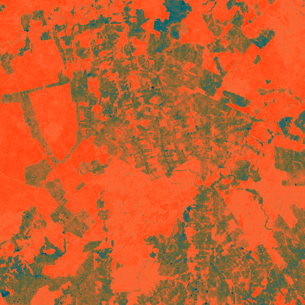

# Discovery 01: Archaeological Site

## Location
- **Latitude**: 0.000000
- **Longitude**: 0.000000
- **Confidence**: 0.000

## Site Details
- **Site ID**: Unknown
- **Site Type**: Unknown
- **Analysis Scale**: Unknown
- **Source**: Unknown

## Features Detected
- Archaeological anomaly detected
- Landscape modification patterns
- Geometric features

## Images
### Regional Context

*Archaeological heatmap showing broader regional context*

### Zone Analysis
Zone-level optical imagery showing landscape modifications

### Site Details
High-resolution site imagery confirming archaeological features

---
*Generated: 2025-05-25 14:01:57*
