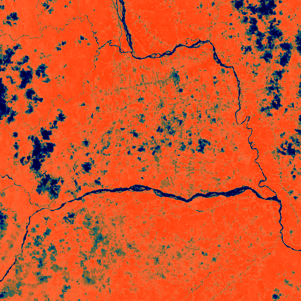

# Discovery 02: Archaeological Settlement

## Location
- **Latitude**: -1.891551
- **Longitude**: -78.103642
- **Confidence**: 1.000

## Site Details
- **Site ID**: AMAZON_EC_Secondary_002
- **Site Type**: Archaeological Settlement
- **Site Function**: Fortified settlement with defensive features
- **Region**: Northern Upano Valley Extension, Ecuador
- **Country**: Ecuador
- **Analysis Scale**: site
- **Source**: Multi-scale archaeological network analysis

## Features Detected
### Primary Indicators
- Defensive earthworks
- Geometric site layout
- Large settlement area
### Secondary Evidence
- Soil composition anomalies

## Measurements
- **Area**: 77 hectares
- **Defensive Rings**: 3
- **Geometric Regularity**: 0.746
- **Elevation Prominence**: 0.703

## Cultural Context
- **Primary Culture**: Pre-Columbian Amazonian settlement
- **Time Period**: Pre-Columbian (estimated 500-1500 CE)
- **Cultural Affiliation**: Amazonian pre-Columbian culture (unspecified)

## Images
### Regional Context

*Archaeological heatmap showing broader regional context*

### Zone Analysis
Zone-level optical imagery showing landscape modifications

### Site Details
High-resolution site imagery confirming archaeological features

---
*Generated: 2025-05-25 16:22:33*
