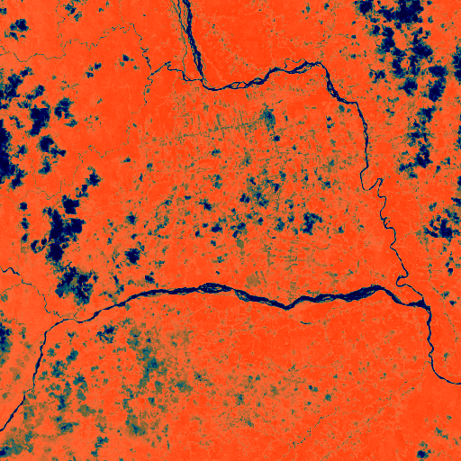

# Discovery 03: rectilinear_layout

## Location
- **Latitude**: -1.964000
- **Longitude**: -78.012500
- **Confidence**: 0.920

## Site Details
- **Site ID**: AMAZON_EC_Tertiary_003
- **Site Type**: rectilinear_layout
- **Site Function**: Residential settlement or specialized structure
- **Region**: Northern Upano Valley Extension, Ecuador
- **Country**: Ecuador
- **Analysis Scale**: site
- **Source**: Multi-scale archaeological network analysis

## Features Detected
### Primary Indicators
- Vegetation anomalies
### Secondary Evidence
- Soil composition anomalies

## Measurements
- **Area**: 0 hectares
- **Defensive Rings**: 0
- **Geometric Regularity**: 0.000
- **Elevation Prominence**: 0.000

## Cultural Context
- **Primary Culture**: Pre-Columbian Amazonian settlement
- **Time Period**: Pre-Columbian (estimated 500-1500 CE)
- **Cultural Affiliation**: Amazonian pre-Columbian culture (unspecified)

## Images
### Regional Context

*Archaeological heatmap showing broader regional context*

### Zone Analysis
Zone-level optical imagery showing landscape modifications

### Site Details
High-resolution site imagery confirming archaeological features

---
*Generated: 2025-05-25 16:22:33*
