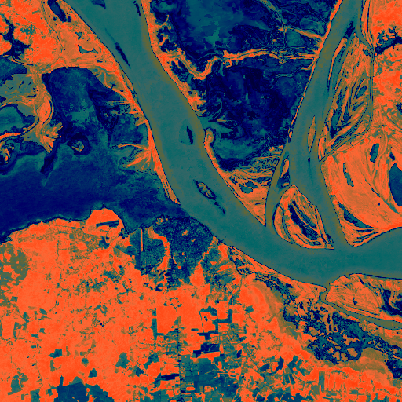

# Discovery 04: Archaeological Settlement

## Location
- **Latitude**: -2.288179
- **Longitude**: -54.786878
- **Confidence**: 0.900

## Site Details
- **Site ID**: AMAZON_BR_Secondary_004
- **Site Type**: Archaeological Settlement
- **Site Function**: Upper Xingu satellite settlement
- **Region**: Santarém Archaeological Region, Brazil
- **Country**: Brazil
- **Analysis Scale**: site
- **Source**: Multi-scale archaeological network analysis

## Features Detected
### Primary Indicators
- Defensive earthworks
- Geometric site layout
- Large settlement area
### Secondary Evidence
- Soil composition anomalies

## Measurements
- **Area**: 47 hectares
- **Defensive Rings**: 1
- **Geometric Regularity**: 0.753
- **Elevation Prominence**: 0.677

## Cultural Context
- **Primary Culture**: Upper Xingu cultural complex
- **Time Period**: 800-1500 CE (Late Period)
- **Cultural Affiliation**: Upper Xingu cultural complex

## Images
### Regional Context

*Archaeological heatmap showing broader regional context*

### Zone Analysis
Zone-level optical imagery showing landscape modifications

### Site Details
High-resolution site imagery confirming archaeological features

---
*Generated: 2025-05-25 16:22:33*
